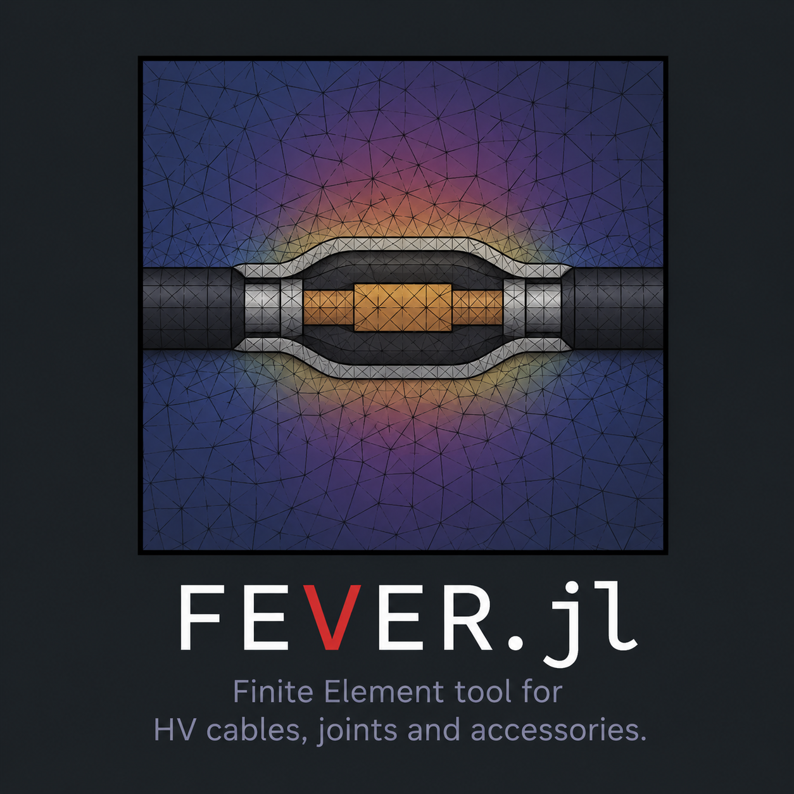

# FEVER.jl - A finite element tool for electrothermal simulations in high-voltage engineering

<p align="center">
  
</p>

**FEVER.jl** is a Julia-based finite element tool developed by Arturo Popoli and Simone Vincenzo Suraci at the Department of Electrical, Electronic and Information Engineering "Guglielmo Marconi" of the University of Bologna. The code is intended for the simulation of linear and nonlinear electrothermal problems in high-voltage engineering, with a focus on HVDC cable systems, cable joints, and related insulation configurations.

---

## Applications

FEVER.jl solves electrothermal problems for HVDC and HVAC cable systems, with emphasis on cable joints, accessories, and nonlinear dielectric conductivity laws for insulating polymers depending on temperature and electric field.

Typical analyses include:

- Electric-field stress evaluation in HVDC and HVAC cable insulation systems
- Identification of critical regions such as material interfaces, geometric transitions, and triple points
- Assessment of nonlinear field redistribution in dielectrics with temperature-dependent and field-dependent conductivity
- Comparison of insulation materials, field-grading materials, and user-defined dielectric conductivity laws
- Study of longitudinal heat exchange in joints, accessories, and nonuniform cable layouts
- Assessment of installation conditions such as direct burial, ducts, tunnels, air-exposed sections, and external thermal resistances

---

## Main features

- 2D, 2D axisymmetric, and 3D finite element formulations with arbitrary (`Ferrite.jl`)
- Gmsh-based mesh generation and parametric geometry mesh studies with (`Gmsh.jl`)
- User-defined nonlinear material laws and internal material library (support for temperature-dependent and field-dependent properties)
- Newton-type nonlinear solution of the electric problem wirth automatic differentiation and sparse Jacobian coloring
- Thermal exchange boundary conditions for soil, air, ducts, and external domains
- IEC 60287-based buried-cable thermal boundary conditions
- human-readable `.toml` input files and VTK output for ParaView

---

## Development

FEVER.jl is developed by Arturo Popoli at the Department of Electrical, Electronic and Information Engineering "Guglielmo Marconi", University of Bologna.

The code builds on the original MATLAB prototype [FEVER](https://github.com/apopoli/FEVER), originally developed by Arturo Popoli, Giacomo Pierotti, and Prof. Andrea Cristofolini, with contributions from Prof. Giovanni Mazzanti. The finite element formulation and its application to HVDC cable-joint electrothermal simulations are described in the FEVER reference paper reported in the Citation section. FEVER.jl supports more general 2D, 2D axisymmetric, and 3D geometries, larger finite element meshes, and nonlinear dielectric conduction problems requiring robust residual and Jacobian treatment.

> The source code is currently available upon request.  
> For access, contact **arturo.popoli@unibo.it**

## Mathematical formulation

FEVER.jl solves steady-state electrothermal finite element problems for the temperature $T$ and electric scalar potential $\phi$.

The thermal problem is

```math
\nabla \cdot \left( k \nabla T \right) = -q_J
```

with Joule source

```math
q_J = \frac{J^2}{\sigma}
```

The stationary electric problem is

```math
\nabla \cdot \left( \sigma \nabla \phi \right) = 0
```

where

```math
\mathbf{E} = -\nabla \phi,
\qquad
E = |\mathbf{E}|
```

For HV insulation systems, the conductivity may depend on temperature and electric-field magnitude,

```math
\sigma = \sigma(T,E)
```

so that the electric problem becomes nonlinear:

```math
\nabla \cdot
\left[
\sigma(T,|\nabla \phi|)
\nabla \phi
\right]
=
0
```

A representative conductivity law is

```math
\sigma(T,E)
=
\sigma_0
\exp
\left[
\alpha (T - T_0) + \beta E
\right]
```

After finite element discretization, the thermal problem gives a linear system,

```math
\mathbf{K}_T \mathbf{T}
=
\mathbf{f}_T
```

while the electric problem gives a nonlinear residual equation,

```math
\mathbf{R}_\phi(\boldsymbol{\phi}) = \mathbf{0}
```

solved with Newton-type methods,

```math
\mathbf{J}_\phi
\delta \boldsymbol{\phi}
=
-
\mathbf{R}_\phi
```

FEVER.jl handles the nonlinear Jacobian using automatic differentiation and sparse coloring.

Thermal exchange with the environment is imposed through Robin-type boundary conditions,

```math
-k \frac{\partial T}{\partial n}
=
h(T - T_\mathrm{ext})
```

including IEC 60287-type heat-transfer coefficients for buried cable systems,

```math
h(r)
=
\frac{1}{2\pi r R_T(r)}
```

where $R_T(r)$ is the local external thermal resistance.

## Citation

If you use FEVER or FEVER.jl in scientific work, please cite:

G. Pierotti, A. Popoli, F. Ragazzi, B. Diban, A. Cristofolini and G. Mazzanti,  
"FEVER – Fem Electrothermal solVER: application to an HVDC joint,"  
*2023 IEEE International Conference on Environment and Electrical Engineering and 2023 IEEE Industrial and Commercial Power Systems Europe*,  
Madrid, Spain, 2023, pp. 1–6,  
doi: [10.1109/EEEIC/ICPSEurope57605.2023.10194669](https://doi.org/10.1109/EEEIC/ICPSEurope57605.2023.10194669)

```bibtex
@inproceedings{pierotti2023fever,
  author    = {Pierotti, Giacomo and Popoli, Arturo and Ragazzi, Fabio and Diban, Bassel and Cristofolini, Andrea and Mazzanti, Giovanni},
  title     = {{FEVER -- Fem Electrothermal solVER: application to an HVDC joint}},
  booktitle = {2023 IEEE International Conference on Environment and Electrical Engineering and 2023 IEEE Industrial and Commercial Power Systems Europe},
  address   = {Madrid, Spain},
  year      = {2023},
  pages     = {1--6},
  doi       = {10.1109/EEEIC/ICPSEurope57605.2023.10194669}
}